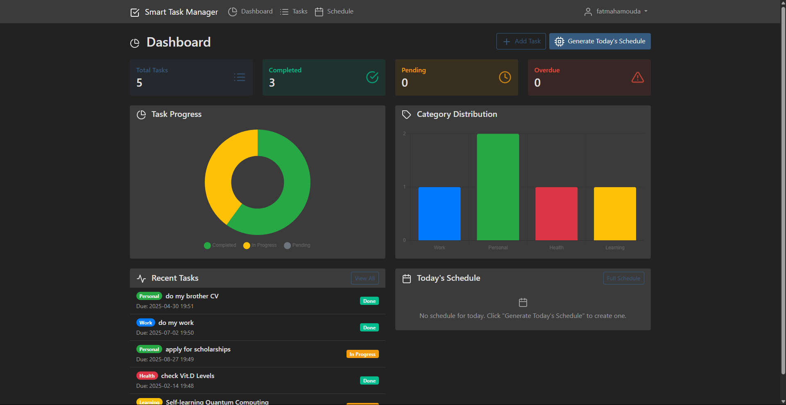

# Smart Task Manager

A comprehensive Flask-based web application for intelligent task management with AI-powered scheduling, progress analytics, and productivity insights.

## Features

- **Task Management**: Create, edit, and organize tasks with categories and priorities
- **AI-Powered Scheduling**: Intelligent daily schedule generation based on task priority, deadlines, and estimated durations
- **Progress Analytics**: Visual dashboard with charts showing completion rates and productivity metrics
- **Category System**: Color-coded task categories for better organization
- **Time Tracking**: Estimated duration tracking and schedule optimization
- **User Authentication**: Secure user registration and login system
- **Responsive Design**: Modern, mobile-friendly interface with dark theme support

## Technology Stack

- **Backend**: Python 3.11, Flask, SQLAlchemy
- **Frontend**: Bootstrap 5, Chart.js, Feather Icons
- **Database**: SQLite (development), PostgreSQL (production)
- **Authentication**: Flask-Login with secure password hashing

## Usage

1. **Register/Login**: Create an account or sign in to access your tasks
2. **Create Tasks**: Add tasks with titles, descriptions, categories, priorities, and due dates
3. **Generate Schedule**: Use the AI scheduler to create optimized daily plans
4. **Track Progress**: Monitor your productivity through the dashboard analytics
5. **Manage Categories**: Organize tasks with custom color-coded categories

## AI Scheduling Algorithm

The intelligent scheduling system considers:
- Task priority levels (1-5 scale)
- Due date urgency
- Estimated duration
- Available work hours
- Task dependencies and optimal time blocks
  

## API Endpoints

### Authentication
- `POST /register` - User registration
  

- `POST /Sign in` - User Sign-in
  

- `GET /logout` - User logout

### Tasks
- `GET /api/tasks` - Get all user tasks
- `POST /api/tasks` - Create new task
- `PUT /api/tasks/<id>` - Update task
- `DELETE /api/tasks/<id>` - Delete task
  

### Categories
- `GET /api/categories` - Get all categories
- `POST /api/categories` - Create new category
  

### Schedule
- `POST /api/schedule/generate` - Generate optimized schedule
- `GET /api/schedule/<date>` - Get schedule for specific date
  

